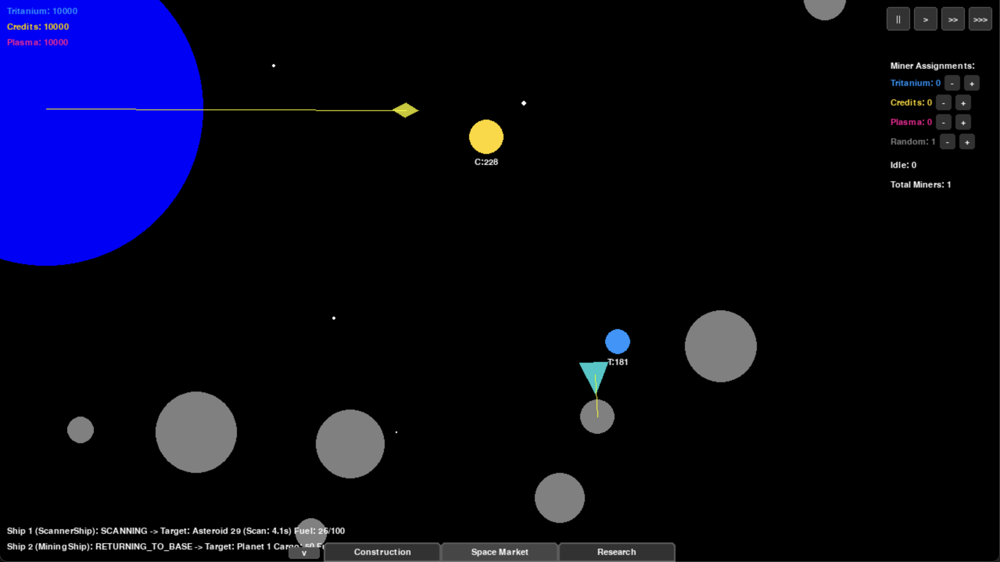
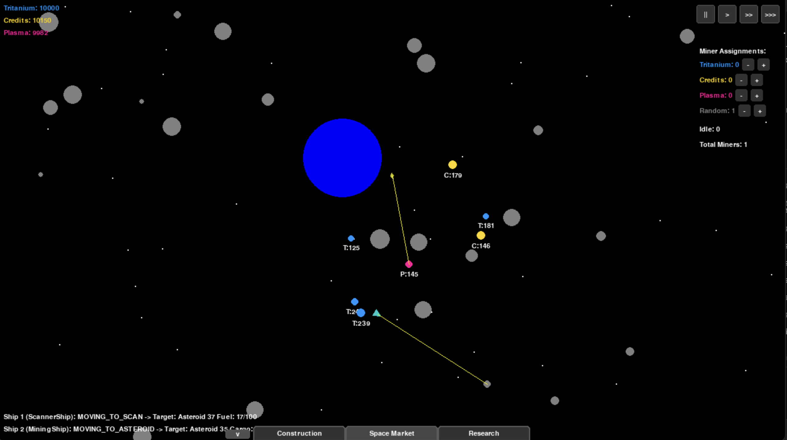
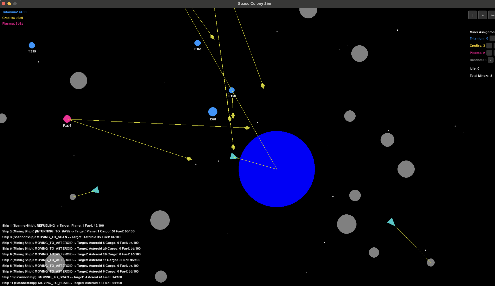
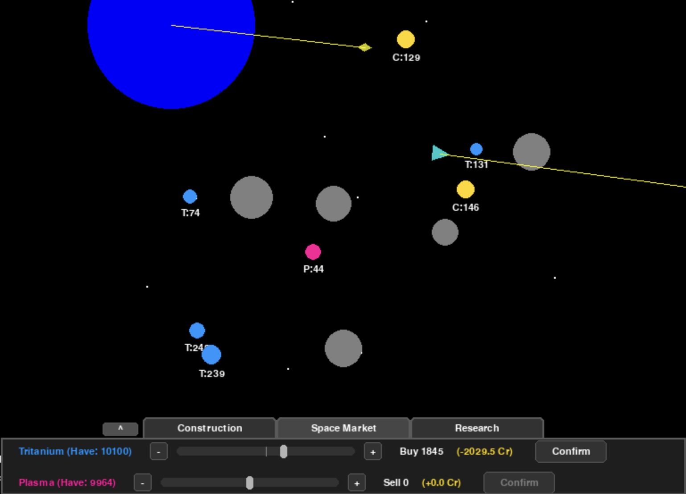
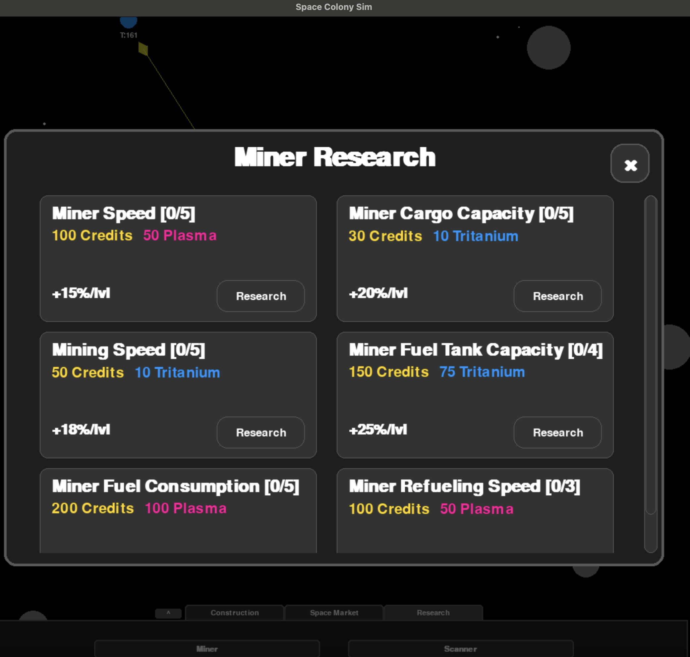

# Colony: A Space Mining & Economy Simulation

Colony is a 2D top-down space simulation game built with Python and Pygame. Players manage a fleet of autonomous spaceships to scan for resources, mine asteroids, and expand their industrial empire through strategic upgrades and market trading.



## Key Features

### 1. Core Gameplay Loop
- **Scan & Discover:** Deploy scanner ships to survey the galaxy and identify valuable resources hidden in asteroids.
- **Mine & Haul:** Dispatch mining ships to extract resources like Tritanium, Credits, and Plasma. Ships have limited cargo space and must return to base to offload.
- **Build & Expand:** Use your stockpiled resources to construct new scanner and mining ships, growing your fleet and operational capacity.



### 2. Autonomous AI Fleet
- **Intelligent Pathfinding:** Ships navigate the star system, moving to targets and avoiding collisions with celestial bodies.
- **Smart Targeting:** Scanner ships automatically coordinate to avoid scanning the same asteroid simultaneously.
- **Priority-Based Mining:** Set resource priorities (Tritanium, Credits, Plasma) via UI sliders, and your mining ships will intelligently choose targets to match your strategic goals.




### 3. Dynamic Economy
- **Space Market:** A central market allows you to convert between different resource types.
- **Fluctuating Rates:** Exchange rates are not static. They adjust based on your trading activity and will gradually decay back towards a baseline value over time, creating a dynamic economic challenge.


*Trading resources on the dynamic space market.*

### 4. Research & Development
- **Tech Tree:** Invest your resources into a research system to unlock powerful upgrades.
- **Ship Enhancements:** Improve your fleet's capabilities with upgrades to:
    - Ship Speed
    - Cargo Capacity
    - Mining Speed & Efficiency
    - Scanner Speed & Radius


*Unlocking new technologies in the research panel.*

### 5. UI & Controls
- **Full Camera Control:** Zoom in on the action or pan out to get a strategic overview of the system.
- **Resource Dashboard:** Keep track of your resource stockpile at the central planet.
- **Interactive Menus:** Manage research, set mining priorities, and trade on the market through intuitive UI panels.

---

## How to Run

1.  **Install Dependencies:**
    ```bash
    pip install -r requirements.txt
    ```
2.  **Run the Game:**
    ```bash
    python main.py
    ```
